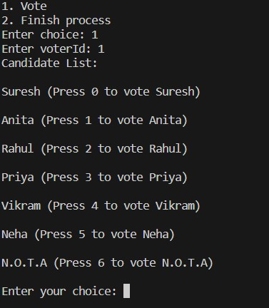
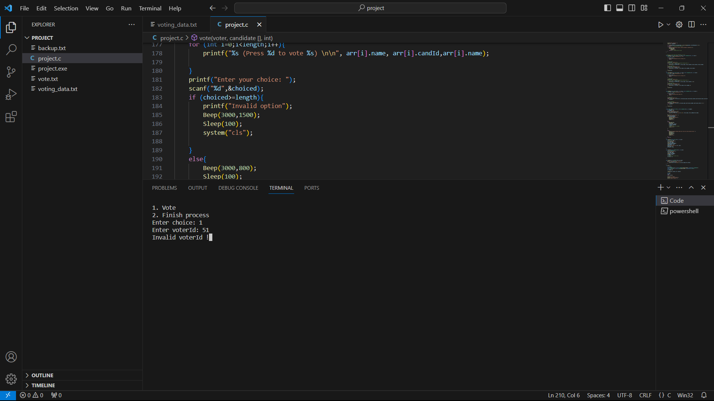
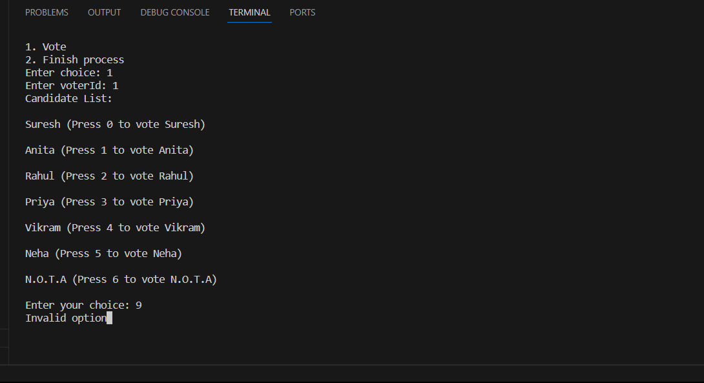
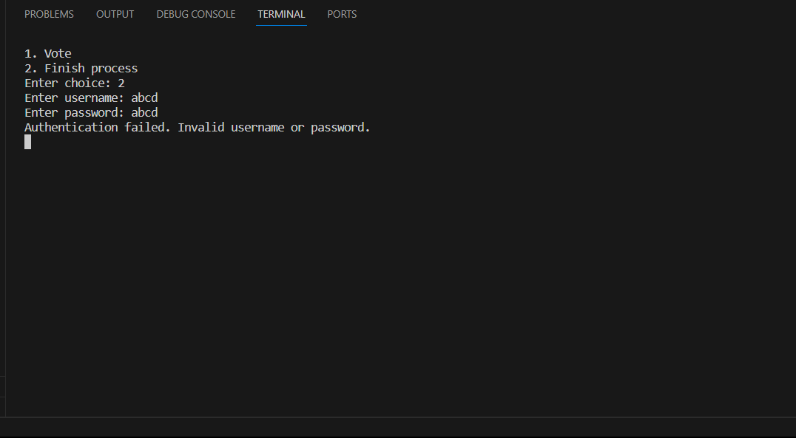
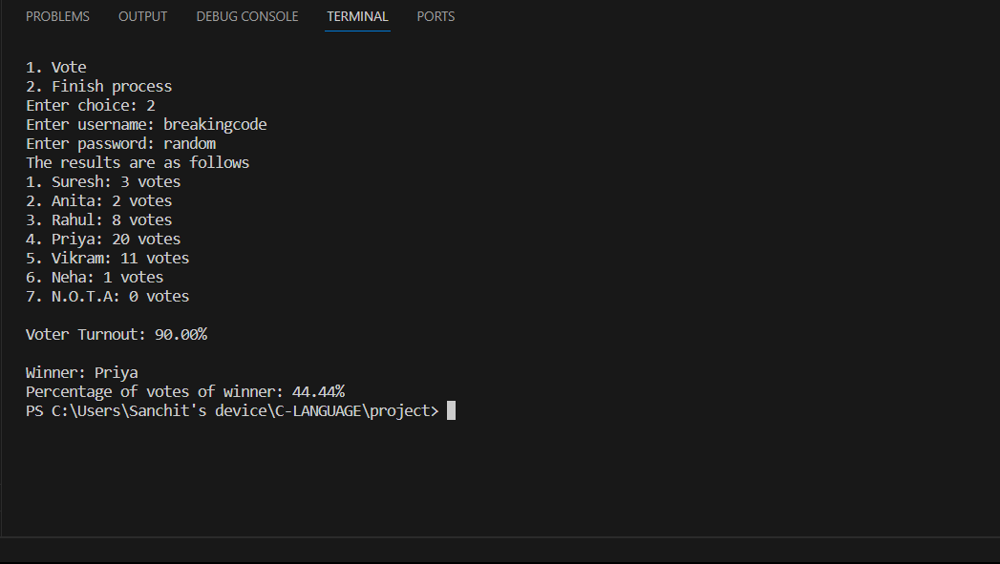

# Team information 
###  Breaking Code (Mini Voting System)
|Name|Roll no.|
|-------|-------|
|Sanchit Garg|B23CY1019|
|Vaibhav Garg|B23CM1046|
|Prashasta Srivastava|B23EE1057|
|Shlok Kanani|B23CS1068|
# How to execute the code 
This code in written in C language
###### Step 1: Download VS code
###### Step 2: If you are windows user download a gcc compiler
###### Step 3: Download the code and run it in VS code.
###### Step 4: Input the suitable data according to the instruction appearing on the terminal
# Enviroment setup
#### Download VSCode or any other similar IDLE for C language
#### Download C compiler.

# Dependencies
#### voting_data.txt
#### Currently working only on windows platform

# Execution guidelines
#### Step1: User is presented with 2 choices
##### Case 1: User types 1 into the terminal-(Voting begins)

##### User is asked for his voter ID
##### E.g User enters his voter ID as 1 in the terminal (User presented with the list of candidates along with their corresponding serial number)

##### If user enters invalid voter ID, an error beep is sounded and "Invalid voter ID" message is shown.

##### If user chooses invalid option for his vote ,an error beep is sounded and "Invalid option" message is shown.

##### After entering the choice of candidate,confirmation beep sounds,the terminal clears,vote is added to the chosen candidate and terminal is cleared to initate voting for another voter.

##### Case 2: User types 2 into the terminal (Voting process ends after entering correct user name and password given to authorised people ).
#### username: breakingcode
#### password: random
##### if user enters wrong username or password,an "Authentication failed.Invalid username or password"

##### After entering correct username and password,voting process ends,final votes are calculated.Voter turnout is calculated and printed.Name of winner is printed along with the percentage of votes the winner received.

**Pobot Chat Application**

Pobot is a Streamlit-based chat application that allows users to generate rhyming poems, find better titles for poems, merge poems, find internet matches for poems, and view chat history. It integrates with Google Search API and Firestore for storing user interactions.

**Features**

*   Generate rhyming poems based on a given title and theme.
*   Find better titles for poems using OpenAI's GPT-3.5-turbo model.
*   Merge two poems to create a new poem with a mix of themes and styles.
*   Find internet matches for poems to discover similar poems online.
*   View chat history to revisit previous interactions.

**Installation**

1.  Clone the repository:

   ```bash
   git clone https://github.com/your-username/pobot-chat-app.git
   cd pobot-chat-app
   ```

2.  Install the required dependencies:

   ```bash
   pip install -r requirements.txt
   ```

3.  Set up Firebase Admin SDK:
   *   Create a Firebase project and download the service account key file (`firebase-adminsdk.json`).
   *   Place the key file in the root directory of the project.

4.  Set up API keys:
   *   Set your OpenAI API key in the environment variable `OPENAI_API_KEY`.
   *   Set your Google API key in the environment variable `GOOGLE_API_KEY`.
   *   Set your Google Custom Search Engine (CSE) ID in the environment variable `GOOGLE_CSE_ID`.

**Usage**

1.  Run the Streamlit app:

   ```bash
   streamlit run app.py
   ```

2.  Log in to the app with your username.
3.  Use the various functionalities provided by the app:
   *   Generate rhyming poems.
   *   Find better titles for poems.
   *   Merge poems.
   *   Find internet matches for poems.
   *   View chat history.

**Directory Structure**

*   `app.py`: Main Streamlit application file.
*   `requirements.txt`: List of dependencies.
*   `firebase-adminsdk.json`: Firebase Admin SDK key file (not included in the repository).
*   `README.md`: Project documentation.
*   `chroma_db_oai/`: Directory for Chroma vectorstore data.
*   `langchain_openai/`: Custom language chain module.
*   `langchain_community/`: Community language chain utilities.
*   `langchain/`: Core language chain modules.
*   `static/`: Static assets for the app.
